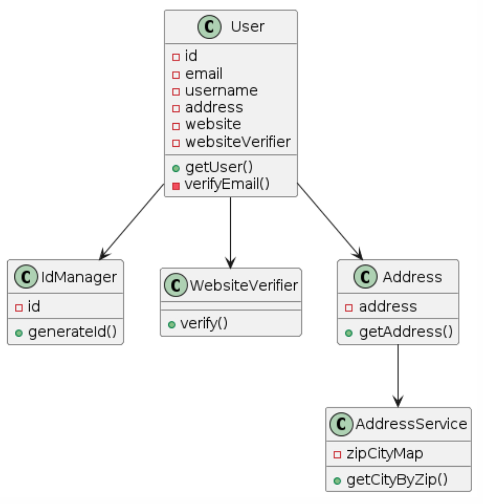

# ankh-uml

Ankhorage is the entrypoint of multiple tools that help plan, implement, test & document IT projects.

## Quickstart

```bash
npx ankh-uml path/to/RootClass.ts .
```



## Features

Generate UML diagrams for your TypeScript classes.

This allows inspection of parts of your whole architecture. Furthermore you can enable/disable features like:

- [x] Start from a root file (entrypoint)
- [ ] Show/hide interfaces
- [ ] Show/hide types
- [ ] Show/hide return values
- [ ] Show/hide parameters
- [ ] Show/hide dependencies
- [ ] Set the depth of the diagram
- [ ] Choose between multiple renderers
  - [ ] Mermaid
  - [x] PlantUML

## Contributing

At the moment the tools are written for Node.js & TypeScript.

However other languages, platforms & tools are welcome.

### Attach your tool

If you have a tool that you want to attach to Ankhorage, you can do so by providing a NPX entrypoint.

### Enhance this repository

If you want to enhance this repository, you can do so by providing a PR.

#### Conventions

| Convention | Details                  |
| ---------- | ------------------------ |
| eslint     | `eslint-google-config`   |
| prettier   | `artiphishle/prettierrc` |

#### Conventions

Entrypoint:

- Naming: `ankh-<toolname>`.
- Callable via: `npx ankh-<toolname>`.
- Styling of stdout style as in `npx ankhorage`.

## Changelog

### 2024/02/23

- Repo renaming and move to meta repository

### 2024/02/20

- Created a standalone package for ankh-tools-uml
- Add `examples/` directory with a UML example

### 2024/02/19

#### Added UML Generator

- Basic support of UML generation for a single TS Class
- Generating UML using PlantUML (Mermaid planned).
